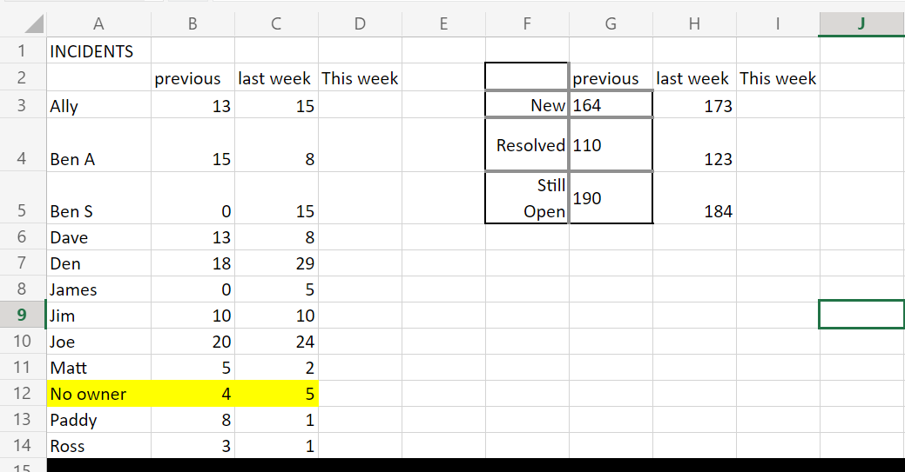
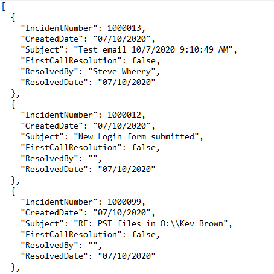
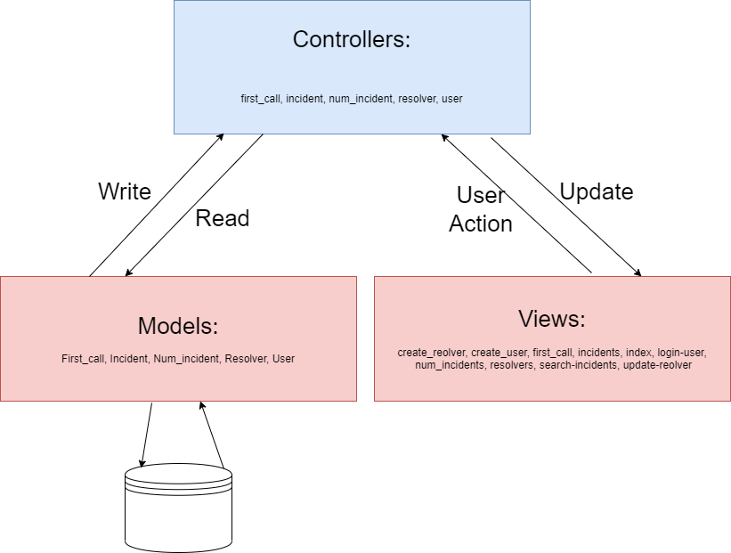
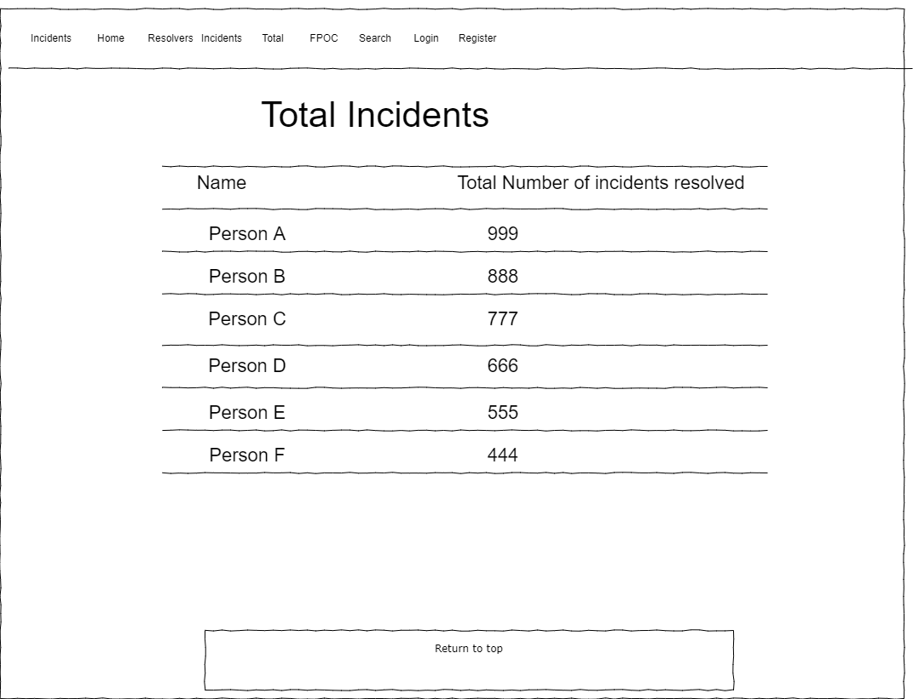

# COM519AE1
Advanced Databases COM519AE1 Assessment

# Alastair Cox

## Web Application

https://ancient-lowlands-53604.herokuapp.com/

## Github Repository

https://github.com/wheelostair/COM519AE1

# Introduction

I was asked to solve a problem in my work or home life, by building a data-driven full stack web-application.
I work for the Isle of Wight council in the ICT team. Each week our line manager is supposed to provide us with a rundown of the number of incidents and service requests we have each completed, and the number of those we have completed on first point of contact.
However, most weeks the line manager hasn't had the time to collate the information, or the information is presented on a hard to read spreadsheet format.

The info above was hard to understand, not very easy to look at and was a struggle each week for the line manager to complete.
I Thought it would be a great idea to create a web app that could show these numbers and possibly more automatically. Saving the line manager time and making the information more accessible. 

# System Overview

The database is downloaded from the Service management System (SMS) that we have at the council. It is converted from a simple spreadsheet to JSON format.

The data is then aggregated and arranged using a seeder which creates collections of documents which can be used to populate the web app. 
The web app is broken down into a home page, an area to see all the resolvers which can be edited, a list of all the incidents, a list of incidents resolved by each member of the team, a list of all incidents completed at first point of contact, 
an area to search through the incidents and an area to login and register for the web app.

## Basic layout design for web app

### Home Page

### Total Incidents Page

# Key Design Decisions

## Database Design
 
The Database is broken down into five main areas 

1 Incidents
2 Resolvers
3 Number of Incidents
4 First Calls
5 Users

### Incidents

The documents in this collection have all the data collected from the SMS. IncidentNumber, CreatedDate, Subject, FirstCallResolution, ResolvedDate and Name.
This is the set of data which is aggregated using the seeder to create the further collections. This collection populates the incidents web page and the search page.

### Resolvers

The documents in this collection just have an ID and the user’s name. This collection can be updated, added to and deleted. This populates the Resolvers web page.

### Number of incidents

The documents in this collection have an ID, Name and the sum of all incidents completed by that employee. This is used to populate the num_incidents web page and replaces the need for the spreadsheet shown in the introduction.

### First Calls

The documents in this collection have an ID, Name and the sum of all the incidents completed at first point of contact for that employee. It is used to populate the first_call web page and also replaces the need for another spreadsheet.

### Users

The final collection is created when a user creates a login for the web page. You must login to create a new resolver. The documents in this collection have an ID, email, and Password (which is saved hashed). these can be used to login to the web page and create a new resolver if needed.

## Security & Scalability

The application currently shows all of the incidents ever created on the SMS and has over 15,000 documents. However, if used to replace the team statistic spreadsheets shown above only the data from the previous week or month would need to be used. 
It wouldn’t be too difficult to re-create this system using a different dataset to include the service requests from the SMS too. 
The web page could be changed to include a date area where only certain data between two dates were shown.

The system is secure as to make edits you need to register and login to the web page. 

# Conclusion & Reflection

The Web page designed fulfils the brief of solving a problem in the workplace, by creating an easy to view, automatic version of the poorly laid out spreadsheet which we were sometimes provided. It is very simple in design but could be improved in the future to include further data sets, a section to search by date, how many calls have been opened vs closed and a percentage of total calls which have been closed at FPOC.
There are some areas of the web page which i have not finished, including a drop-down list of all the resolvers, which i was attempting to use to navigate to a page which would show all the incidents resolved by that employee, but i was unable to finish this. 
On the search area i was trying to create an area where each user who logged in could save incidents so that they could see them again in the future at a glance. But this is also unfinished. 

At first i struggled quite badly with trying to create the collections, i solved this by including a seeder. I also struggled with hosting the database on a cloud server and hosting the webpage, but with trial and error i finally managed to host these.
I recognise that the design is simple and could be improved, but i am happy with the functionality and believe that i can use the skill learnt completing this assessment in the future, to further my career.   
